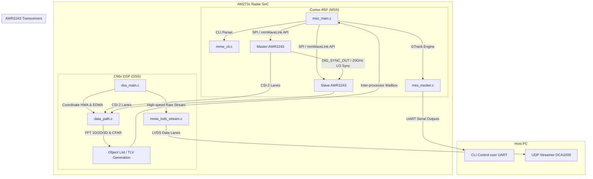

# AM273x + AWR2243 2-Chip Cascade Radar Demo Developer Guide

This guide provides a detailed explanation of the architecture, file structure, build configurations, and operation of the **AM273x + AWR2243 2-Chip Cascade Radar Demo** (TDM and DDM processing modes) sourced from the TI Radar Toolbox.

---

## 1. System Architecture

The Cascade radar environment splits operations across three logical layers: the **Master Subsystem (MSS)** running on the Cortex-R5F core, the **DSP Subsystem (DSS)** running on the C66x DSP, and the **Radar Subsystem (BSS)** running directly on the AWR2243 transceiver chips.



### 1.1 Cortex-R5F Master Subsystem (MSS)
The **MSS** acts as the controller of the radar system:
* **System Control & Boot:** Initializes the AM273x SoC (pinmux, clock tree, drivers, and mailboxes) and spawns the FreeRTOS multitasking runtime.
* **Transceiver Configuration:** Communicates with the two AWR2243 transceivers over dedicated SPI buses using the **mmWaveLink API**. During boot, it downloads the BSS firmware patch (`xwr2x4xp_radarss_metarprc.bin`) into the transceivers.
* **CLI Parser (`mmw_cli.c`):** Sinks ASCII chirp configurations from the host over the `UART` serial control port, processes them into profile structures, and programs them into the transceivers.
* **Target Tracker (`mss_tracker.c`):** Receives the processed point cloud list from the DSP, runs the TI **GTrack target tracking algorithm** (an extended Kalman-filter-based cluster tracker), and formats point-cloud and tracker outputs into TLV (Type-Length-Value) packet frames.
* **Serial Output:** Streams the formatted TLV frames to the host PC over the `UART` data port.

### 1.2 C66x DSP Subsystem (DSS)
The **DSS** handles the high-throughput, real-time signal processing datapath:
* **Datapath Coordination (`dss_main.c` / `data_path.c`):** Sets up and coordinates the **Hardware Accelerator (HWA)** and **EDMA** controllers to process incoming ADC data blocks.
* **1D Range Processing:** Processes raw ADC samples via Range FFTs.
* **2D Doppler Processing:** Resolves relative target velocities via Doppler FFTs.
* **3D Angle/Aperture Processing:** Computes Angle FFTs across the virtual receiver array to resolve azimuth and elevation angles.
* **CFAR & Target Detection:** Runs Constant False Alarm Rate (CFAR) algorithms to identify target reflections, creating a 3D/4D point cloud.
* **Raw Data Streaming (`mmw_lvds_stream.c`):** Configures the CSI-2 wrapper on the AM273x to package and stream raw ADC data frames over the LVDS lanes directly to the DCA1000 capture card.

### 1.3 BSS (Radar Subsystem / AWR2243 Firmware)
The AWR2243 front-end chips contain their own internal micro-controller core running BSS code:
* Manages the analog hardware, synthesizer frequency ramps (chirps), PLLs, local oscillators, and high-speed ADCs.
* **Synchronization:** In the 2-chip Cascade system, the Master AWR2243 distributes its 20 GHz Local Oscillator (LO) clock and hardware `DIG_SYNC_OUT` pulse to the Slave AWR2243 to maintain tight phase synchronization across all 8 Rx lanes.

---

## 2. MIMO Processing Modes: TDM vs DDM

The codebase supports two distinct Multiple-Input Multiple-Output (MIMO) processing targets:

| Feature | Time Division Multiple Access (TDM) | Doppler Division Multiple Access (DDM) |
|---|---|---|
| **Transmission Scheme** | Transmitters (TX) pulse sequentially in time. | Transmitters (TX) transmit simultaneously. |
| **TX separation** | Separated by time slot. | Separated in the Doppler domain by phase codes. |
| **Max Unambiguous Velocity** | Limited, as TX multiplexing reduces the effective pulse repetition frequency (PRF). | Maximized (unaffected by multiplexing since all transmitters fire concurrently). |
| **Signal-to-Noise Ratio (SNR)** | Standard. | Increased due to higher cumulative transmit power. |
| **Application** | Standard automotive ranging and parking. | High-speed ADAS, highway driving, and long-range tracking. |

---

## 3. Directory and File Structure

Below is the directory map of the Cascade project under `firmware/cascade/src/demo/`:

```text
firmware/cascade/src/demo/
├── chirp_configs/                  # Reference chirp configurations (.cfg files)
├── docs/                           # Documentation (release notes, user guide, and this guide)
├── prebuilt_binaries/              # Precompiled .appimage and .elf reference binaries
│
└── src/awr2243/                    # Source code root
    ├── mmwave2chipCascade_mss.projectspec  # CCS MSS Project definition (Cortex-R5F)
    ├── mmwave2chipCascade_dss.projectspec  # CCS DSS Project definition (C66x DSP)
    │
    └── ti/                         # Sourced SDK Components
        ├── alg/                    # Sourced algorithm implementations (e.g., GTrack)
        ├── board/                  # Board-specific configurations (e.g., antenna geometries)
        ├── common/                 # Common/shared macros and configurations
        ├── control/                # Control plane and transceiver interface libraries (mmWaveLink, DPM)
        ├── datapath/               # Signal processing DPUs and execution chain (DPC)
        ├── utils/                  # Utility functions (CLI parser, LVDS packet framing)
        │
        └── demo/am273x/mmw/         # Core application source
            ├── mmw_resDDM.h            # DDM processing resource mappings
            ├── mmw_resTDM.h            # TDM processing resource mappings
            │
            ├── mss/                    # Master Subsystem (Cortex-R5F) source
            │   ├── mss_main.c          # Control loop, initialization, SPI mmWaveLink setup
            │   ├── mmw_cli.c           # CLI serial commands interface
            │   ├── mss_tracker.c       # GTrack clustering and tracking algorithms
            │   ├── mss.syscfg          # AM273x pins, clocks, and peripheral configurations
            │   ├── mss_enet.syscfg     # SysConfig with Ethernet configurations enabled
            │   ├── mmw_mss_linker.cmd  # Linker script mapping R5F memory segments
            │   └── mssgenerated/       # Autogenerated SysConfig output sources
            │
            └── dss/                    # DSP Subsystem (C66x DSP) source
                ├── dss_main.c          # C66x DSP task loop, HWA / EDMA setup
                ├── data_path.c         # Radar signal processing datapath (Range/Doppler/Angle)
                ├── mmw_lvds_stream.c   # Manages high-speed raw LVDS data streaming
                ├── dss.syscfg          # DSP peripheral and HWA configurations
                ├── mmw_dss_linker.cmd  # Linker script mapping C66x memory segments
                └── dssgenerated/       # Autogenerated SysConfig output sources
```

### 3.1 Overview of Sourced SDK Folders
The files in the `src/awr2243/ti/` directory are structured to match the layout of the TI mmWave MCU+ SDK (`/opt/ti/mmwave_mcuplus_sdk_04_04_01_02/ti/`). They contain custom, optimized components required for the 2-chip Cascade Demo that are not present or differ from the standard single-chip SDK examples.

*   **`ti/alg/` (Algorithms):** Contains target clustering and tracking source files under `alg/gtrack/`. This implements the GTrack algorithm (Extended Kalman filter tracking) running on the MSS.
*   **`ti/board/` (Board Configurations):** Contains `board/antenna_geometry.h` which specifies virtual channel spacing and coordinates based on the physical EVM antenna layout.
*   **`ti/common/` (Common Headers):** Holds `common/syscommon.h` which contains shared constants, data types, and macro definitions used across both the DSS and MSS cores.
*   **`ti/control/` (Control Layer):** Contains components responsible for managing the transceivers and inter-processor communication:
    *   `control/mmwavelink/` & `control/mmwave/`: Low-level drivers implementing the SPI control protocol used to configure, initialize, and monitor the two AWR2243 chips.
    *   `control/dpm/`: Data Path Manager (DPM) library that manages synchronization, command dispatching, and core-to-core signaling between R5F (MSS) and C66x (DSS) mailboxes.
*   **`ti/datapath/` (Datapath Components):** Integrates the signal processing algorithms:
    *   `ti/datapath/dpc/`: Data Path Chains (such as `objectdetection`), which orchestrate the hardware accelerators (HWA) and EDMA transfers.
    *   `ti/datapath/dpu/`: Individual Data Path Processing Units. Specifically, this folder contains custom units like `rangeprocDDMA` and `dopplerprocDDMA` tailored to process Doppler Division Multiple Access signals.
*   **`ti/utils/` (Utilities):** Includes parser scripts for CLI command processing (`utils/cli/`) and data header formatting configurations for the raw high-speed data stream (`utils/hsiheader/`).

### 3.2 Compilation/Sync Mechanism
At build time, these files are overlaid onto the official container-internal SDK path (`/opt/ti/.../ti/`). This ensures that local host edits in your repository's `firmware/` directory are compiled, while maintaining a clean, isolated build environment in Docker.

---

## 4. Compilation and Build Instructions

The Cascade projects are compiled headlessly inside the Docker environment. There are no Code Composer Studio (CCS) GUI dependencies.

### 4.1 Automated Build Commands
From the root of the repository, execute the following commands on the host machine:

* **Compile DDM/TDM Demos:**
  ```bash
  docker compose run --rm firmware-env /build_context/build_cascade.sh
  ```
  This runs the compilation scripts within the container and creates the following host outputs:
  * `build/cascade/am273x_cascade.elf` (Cortex-R5F MSS ELF debug executable)
  * `build/cascade/am273x_cascade.appimage` (Signed multi-core flash image containing MSS, DSS, and the AWR2243 BSS patches)

### 4.2 How the Makefile Works
The makefile located at `/opt/ti/mmwave_mcuplus_sdk_04_04_01_02/ti/demo/am273x/mmw/makefile` compiles the binaries. It utilizes:
1. **SysConfig Generation:** Generates pinmux and peripheral initializers from the `mss.syscfg` and `dss.syscfg` files.
2. **MSS Compilation:** Invokes the TI Arm Clang Compiler (`tiarmclang`) to build R5F object files and link them using `mmw_mss_linker.cmd`.
3. **DSS Compilation:** Invokes the C6000 Compiler (`cl6x`) to build DSP object files and link them using `mmw_dss_linker.cmd`.
4. **Binary Packaging:** Runs the Node-based `elf2rprc.js` script to parse the compiled ELF executables, then packages them into a single multicore bootable image using `multicoreImageGen.js`.

### 4.3 Manual Build in Interactive Terminal

If you want to perform manual compiling, debugging, or build only a specific subsystem (MSS or DSS), you can start an interactive bash session in the container and invoke the TI compiler tools directly.

1. **Launch the Container Terminal:**
   ```bash
   docker compose run --rm firmware-env
   ```

2. **Configure the SDK Environment Variables:**
   Run the following commands inside the container shell to source paths and tool configs:
   ```bash
   export MMWAVE_SDK_DEVICE=am273x
   export DOWNLOAD_FROM_CCS=yes
   export M4_RELEASE_OPT=1
   export MSS_AOA_ENABLED=1
   export ECO_MSS_AOA_ENABLED=1

   export MMWAVE_SDK_TOOLS_INSTALL_PATH=/opt/ti
   export CCS_INSTALL_PATH=/opt/ti
   export MMWAVE_SDK_INSTALL_PATH=/opt/ti/mmwave_mcuplus_sdk_04_04_01_02
   export R5F_CLANG_INSTALL_PATH=/opt/ti/ti-cgt-armllvm_2.1.2.LTS
   export CCS_BIN_PATH=/usr/bin
   export CCS_CYGWIN_PATH=/usr/bin
   export SYSCONFIG_INSTALL_PATH=/opt/ti/sysconfig_1.14.0
   export XDC_INSTALL_PATH=/opt/ti/xdctools_3_50_08_24_core
   export MCU_PLUS_AM273X_INSTALL_PATH=/opt/ti/mcu_plus_sdk_am273x_08_05_00_24
   export MMWAVE_XWR2XXX_DFP_INSTALL_PATH=/opt/ti/mmwave_dfp_02_02_04_00
   export C66X_CODEGEN_INSTALL_PATH=/opt/ti/ti-cgt-c6000_8.3.3
   export C66x_DSPLIB_INSTALL_PATH=/opt/ti/dsplib_c66x_3_4_0_0
   export C66x_MATHLIB_INSTALL_PATH=/opt/ti/mathlib_c66x_3_1_2_1
   ```

3. **Verify the Environment Settings:**
   Run the SDK check script to verify the compiler and paths:
   ```bash
   cd /opt/ti/mmwave_mcuplus_sdk_04_04_01_02/scripts/unix
   source ./checkenv.sh
   ```

4. **Sync Local Source to SDK Path:**
   Copy the modified source code from the host workspace mount (`/build_context`) to the container SDK folders:
   ```bash
   cp -rf /build_context/firmware/cascade/src/demo/src/awr2243/ti/* /opt/ti/mmwave_mcuplus_sdk_04_04_01_02/ti/
   ```

5. **Navigate to the Compile Directory:**
   ```bash
   cd /opt/ti/mmwave_mcuplus_sdk_04_04_01_02/ti/demo/am273x/mmw
   ```

6. **Execute Targeted Compilation Commands:**
   * **Clean all outputs:**
     ```bash
     make clean
     ```
   * **Build both cores and package into the multi-core flash image (.appimage):**
     * *DDM Mode:*
       ```bash
       make mmwDemoDDM
       ```
     * *TDM Mode:*
       ```bash
       make mmwDemoTDM
       ```
   * **Build Master Subsystem (MSS) Core Only:**
     ```bash
     make PROC_CHAIN=DDM syscfg mssDemo
     ```
     *(Outputs executable at `./mss/am273x_mmw_demo_mssDDM.xer5f`)*
   * **Build DSP Subsystem (DSS) Core Only:**
     ```bash
     make PROC_CHAIN=DDM syscfg dssDemo
     ```
     *(Outputs executable at `./dss/am273x_mmw_demo_dssDDM.xe66`)*

---

## 5. Chirp Configuration & CLI Protocol

When the firmware boots, it initializes a command-line interface on the MSS UART control port. The host PC configures the radar parameters by sending ASCII configuration lines.

### 5.1 Key CLI Commands
* **`sensorCmd`:** Initiates/stops the radar sensor.
* **`channelCfg`:** Configures active Tx/Rx antennas.
* **`profileCfg`:** Sets up ramp variables (frequencies, slope, ADC sample rates, ramp times, and idle times).
* **`chirpCfg`:** Binds profiles to specific chirp indexes.
* **`frameCfg`:** Sets chirp loops, frame durations, and active captures.

### 5.2 TLV Output Packets
Once active, processed frame targets are streamed over the UART data port using a **Type-Length-Value (TLV)** packet protocol.

---

## 6. Detailed UART TLV Packet Specifications

Every frame packet transmitted over the UART data port consists of a 40-byte Message Header, followed by a variable number of TLV items. Each TLV item consists of an 8-byte TLV Header followed by the TLV payload. The entire packet is padded to a multiple of 32 bytes.

### 6.1 Message Header (40 Bytes)
The message header is defined by `MmwDemo_output_message_header` in `mmw_output.h`:

| Offset | Field | Type | Size | Description |
|---|---|---|---|---|
| 0 | `magicWord` | `uint16_t[4]` | 8 B | Sync pattern. Sourced as `{0x0102, 0x0304, 0x0506, 0x0708}`. Little-endian bytes: `0x02 0x01 0x04 0x03 0x06 0x05 0x08 0x07`. |
| 8 | `version` | `uint32_t` | 4 B | Firmware SDK version encoded value. |
| 12 | `totalPacketLen` | `uint32_t` | 4 B | Total packet size in bytes (including header, all TLVs, and padding). |
| 16 | `platform` | `uint32_t` | 4 B | Platform type identifier (set to `0x2243` for AWR2243 Cascade EVM). |
| 20 | `frameNumber` | `uint32_t` | 4 B | Sequence counter of the frame. |
| 24 | `timeCpuCycles` | `uint32_t` | 4 B | DSP cycle count timestamp when packet was compiled. |
| 28 | `numDetectedObj`| `uint32_t` | 4 B | Total number of detected targets (points) in this frame. |
| 32 | `numTLVs` | `uint32_t` | 4 B | Number of TLV blocks in the packet. |
| 36 | `subFrameNumber`| `uint32_t` | 4 B | Sub-frame index (always `0` in standard frame config). |

### 6.2 TLV Header (8 Bytes)
Each TLV item starts with a header defined by `MmwDemo_output_message_tl`:
*   **`type`** (`uint32_t`, 4 bytes): Sourced from `MmwDemo_output_message_type` enum.
*   **`length`** (`uint32_t`, 4 bytes): Length of the payload in bytes (excluding the 8-byte header).

### 6.3 TLV Payload Structures

#### 1. Detected Points (Type 1: `MMWDEMO_OUTPUT_MSG_DETECTED_POINTS`)
*   **Payload Size:** `16 * numDetectedObj` bytes.
*   **Element Struct (`DPIF_PointCloudCartesian`):**
    *   `x` (`float`, 4 bytes): X-coordinate in meters (lateral spacing).
    *   `y` (`float`, 4 bytes): Y-coordinate in meters (radial range).
    *   `z` (`float`, 4 bytes): Z-coordinate in meters (vertical height).
    *   `velocity` (`float`, 4 bytes): Doppler velocity in m/s (positive = moving away).

#### 2. Detected Points Side Info (Type 7: `MMWDEMO_OUTPUT_MSG_DETECTED_POINTS_SIDE_INFO`)
*   **Payload Size:** `4 * numDetectedObj` bytes.
*   **Element Struct (`DPIF_PointCloudSideInfo`):**
    *   `snr` (`int16_t`, 2 bytes): CFAR cell SNR in 0.1 dB steps.
    *   `noise` (`int16_t`, 2 bytes): CFAR side-band noise floor level in 0.1 dB steps.

#### 3. Compact Point Cloud (Type 104: `MMWDEMO_OUTPUT_MSG_DETECTED_POINTS_COMPACT`)
*   **Payload Size:** `8 * numDetectedObj` bytes.
*   **Element Struct (`DPC_ObjectDetection_PointCloudRadialCompact`):**
    *   `azimSinPhaseQuantized` (`int16_t`, 2 bytes): Quantized azimuth phase angle.
    *   `elevSinPhaseQuantized` (`int16_t`, 2 bytes): Quantized elevation phase angle.
    *   `rangeIdx` (`int16_t`, 2 bytes): Range FFT bin index.
    *   `dopplerIdx` (`int16_t`, 2 bytes): Doppler FFT bin index.

#### 4. Performance Statistics (Type 6: `MMWDEMO_OUTPUT_MSG_STATS`)
*   **Payload Size:** 24 bytes.
*   **Struct (`MmwDemo_output_message_stats`):**
    *   `interFrameProcessingTime` (`uint32_t`, 4 bytes): DSP datapath processing time in microseconds.
    *   `transmitOutputTime` (`uint32_t`, 4 bytes): UART data transmission time in microseconds.
    *   `interFrameProcessingMargin` (`uint32_t`, 4 bytes): Idle time remaining before next frame starts (microseconds).
    *   `interChirpProcessingMargin` (`uint32_t`, 4 bytes): Idle time remaining between chirps (microseconds).
    *   `activeFrameCPULoad` (`uint32_t`, 4 bytes): CPU load (%) during active chirp frame duration.
    *   `interFrameCPULoad` (`uint32_t`, 4 bytes): CPU load (%) during inter-frame interval.

#### 5. Frontend Temperatures (Type 9: `MMWDEMO_OUTPUT_MSG_TEMPERATURE_STATS`)
*   **Payload Size:** 28 bytes.
*   **Struct (`MmwDemo_temperatureStats`):**
    *   `tempReportValid` (`int32_t`, 4 bytes): 0 if valid report from BSS, else invalid.
    *   `temperatureReport` (`rlRfTempData_t`, 24 bytes):
        *   `time` (`uint32_t`, 4 bytes): Device uptime from powerup in ms.
        *   `tmpRx0Sens` / `tmpRx1Sens` / `tmpRx2Sens` / `tmpRx3Sens` (`int16_t`, 2 bytes each): Temperature of RX0-RX3 mixers.
        *   `tmpTx0Sens` / `tmpTx1Sens` / `tmpTx2Sens` (`int16_t`, 2 bytes each): Temperature of TX0-TX2 power amplifiers.
        *   `tmpPmSens` (`int16_t`, 2 bytes): Temperature of PMIC/power section.
        *   `tmpDig0Sens` / `tmpDig1Sens` (`int16_t`, 2 bytes each): Temperature of digital logic blocks.

#### 6. Tracked Targets (Type 10: `MMWDEMO_OUTPUT_MSG_TRACKER`)
*   **Payload Size:** `40 * numTargets` bytes.
*   **Element Struct (`MmwDemo_tracker_out`):**
    *   `posVelAcc` (GTRACK State Vector, 36 bytes): position, velocity, and acceleration in 3D:
        *   `posX`, `posY`, `posZ` (`float`, 4 bytes each): Estimated center coordinates (X, Y, Z) in meters.
        *   `velX`, `velY`, `velZ` (`float`, 4 bytes each): Estimated velocity vectors (X, Y, Z) in m/s.
        *   `accX`, `accY`, `accZ` (`float`, 4 bytes each): Estimated acceleration vectors (X, Y, Z) in m/s^2.
    *   `state` (`uint32_t`, 4 bytes): Track status (e.g., Active, Dynamic, Freeing).

---

## 7. LVDS Raw ADC Data Streaming Output Format

When high-speed raw streaming is enabled via the `lvdsStreamCfg` command, the AM273x hardware serialization wrapper (CBUFF) streams raw ADC data over the LVDS lanes. This is captured by the DCA1000 capture card and sent over Ethernet.

### 7.1 DCA1000 UDP Packet Format
The DCA1000 streams packet payloads over UDP (default host port `4098`). Every UDP packet contains a **10-byte Header** followed by raw payload bytes (up to **1456 bytes**):

```
+---------------------------------------------------------+
|                  Sequence Number (4 B)                  |
+---------------------------------------------------------+
|                  Byte Count (4 B)                       |
+---------------------------------------------------------+
|                  Reserved / Upper Byte Count (2 B)      |
+---------------------------------------------------------+
|                  Payload Data (up to 1456 B)            |
+---------------------------------------------------------+
```

*   **Sequence Number (Bytes 0-3):** 32-bit little-endian integer, incrementing sequentially with every packet to detect packet drops.
*   **Byte Count (Bytes 4-7):** 32-bit little-endian integer representing the cumulative index of the first payload byte in this packet since the capture session started.
*   **Reserved (Bytes 8-9):** Sourced as `0x0000`.

### 7.2 Raw ADC Stream Memory Layout (8-Rx Virtual Array)
For the 2-chip Cascade EVM, the CBUFF software session is configured to stream **userBuffer0** (CSIRX0 - Master Transceiver) followed immediately by **userBuffer1** (CSIRX1 - Slave Transceiver). The CSIRX buffers store samples in a **non-interleaved** channel format.

Thus, for each chirp, the raw stream buffer received over Ethernet is laid out as follows:

```
Chirp Raw Stream Buffer:
+-------------------------------------------------------------------------------+
|                      Block 0: Master Transceiver (CSIRX0)                     |
+---------------------------------------+---------------------------------------+
|  Rx0 Samples (numAdcSamples * 4 B)    |  Rx1 Samples (numAdcSamples * 4 B)    |
+---------------------------------------+---------------------------------------+
|  Rx2 Samples (numAdcSamples * 4 B)    |  Rx3 Samples (numAdcSamples * 4 B)    |
+-------------------------------------------------------------------------------+
|                      Block 1: Slave Transceiver (CSIRX1)                      |
+---------------------------------------+---------------------------------------+
|  Rx4 Samples (numAdcSamples * 4 B)    |  Rx5 Samples (numAdcSamples * 4 B)    |
+---------------------------------------+---------------------------------------+
|  Rx6 Samples (numAdcSamples * 4 B)    |  Rx7 Samples (numAdcSamples * 4 B)    |
+-------------------------------------------------------------------------------+
```

*   **Block 0 Size:** $S = N_{\text{AdcSamples}} \cdot 4_{\text{Rx}} \cdot 4_{\text{Bytes/Sample}}$ bytes.
*   **Block 1 Size:** $S = N_{\text{AdcSamples}} \cdot 4_{\text{Rx}} \cdot 4_{\text{Bytes/Sample}}$ bytes.
*   **Total Chirp Data Size:** $2S$ bytes.

#### Complex Sample Encoding
Each individual complex sample consists of a 16-bit Real (I) and 16-bit Imaginary (Q) integer pair:
*   **Bytes 0-1:** Real (I) Component (signed 16-bit integer, `int16_t` in little-endian format)
*   **Bytes 2-3:** Imaginary (Q) Component (signed 16-bit integer, `int16_t` in little-endian format)

#### Host-Side Reconstruction Map
When parsing the reconstructed frame buffer (size = $\text{ChirpsPerFrame} \times 2S$) into a multi-dimensional array `cube[Frames][Chirps][RxAntennas (8)][AdcSamples]`:
1.  Align the payload bytes of successive UDP packets to form the complete frame buffer.
2.  For a given frame and chirp $c$:
    *   Set the base chirp offset $A_0 = c \times 2S$.
    *   **Master Antennas (Rx0 to Rx3):**
        *   Loop over antenna $a \in [0, 3]$:
            *   Start reading from offset $A_0 + a \times N_{\text{AdcSamples}} \times 4$.
            *   Extract $N_{\text{AdcSamples}}$ complex pairs and store them at `cube[f][c][a][s]`.
    *   **Slave Antennas (Rx4 to Rx7):**
        *   Set the slave block start offset $A_1 = A_0 + S$.
        *   Loop over antenna $a \in [0, 3]$ (mapping to physical receiver array indices $4$ to $7$):
            *   Start reading from offset $A_1 + a \times N_{\text{AdcSamples}} \times 4$.
            *   Extract $N_{\text{AdcSamples}}$ complex pairs and store them at `cube[f][c][a + 4][s]`.
